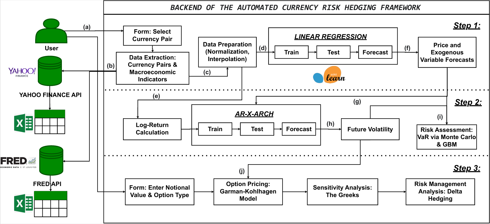

# Optimizing Foreign Exchange Risk Hedging for SMEs

## Introduction

Foreign operations of small and medium-sized enterprises (SMEs) are critically exposed to currency risk. Quick changes in exchange rates have the potential to lower their margins, weaken their profitability, and raise financial uncertainty. Their access to traditional hedging tools frequently involves a challenging trade-off: typical option pricing is based on a static understanding of risk that is not appropriate for changing market conditions, while futures contracts provide strict protection but eliminate any upside potential.

This paper addresses these limitations by proposing a comprehensive and integrated framework for more effective currency risk management. It is based on the fundamental hypothesis that an optimal hedging strategy cannot be limited to a simple point forecast and a deterministic view is insufficient unless accompanied by a rigorous quantification of its surrounding uncertainty. To solve this, our methodology is structured in three sequential stages. First, a machine learning (Linear Regression) model establishes the expected central trajectory of the EUR/USD exchange rate. Second, risk is quantified by modeling the forecast error volatility using the econometric model *AR-X-GARCH*. The joint forecasts of return and volatility are then fed into a Monte Carlo simulation to generate a distribution of future scenarios, synthesized by the Value at Risk (VaR). Finally, this dynamic risk measure forms the basis for designing and analyzing a flexible option-based hedging strategy, demonstrated through a case study with iBanFirst.

The result is a comprehensive decision-making framework that transforms currency risk management from a passive, reactive stance into a proactive, strategic discipline, empowering companies with a robust and strategic approach to foreign exchange risk management.

---

## Quantitative Framework for Dynamic Hedging Optimization

The backend implemented for our proposed currency risk hedging solution is an integrated methodological framework, structured as a three-step sequential process in which each step builds on the results of the previous one, thereby forming a complete pipeline. It revolves around a directional forecast using machine learning, followed by dynamic risk quantification through *AR-X-GARCH* and Monte Carlo simulation to generate a full distribution of future scenarios, which is then summarized in the Value at Risk (VaR) metric, and concludes with the design of a customized hedging strategy.

For a thorough understanding of its functioning, the diagram below visually illustrates the structure of the process and the information flows that ensure its consistency.

