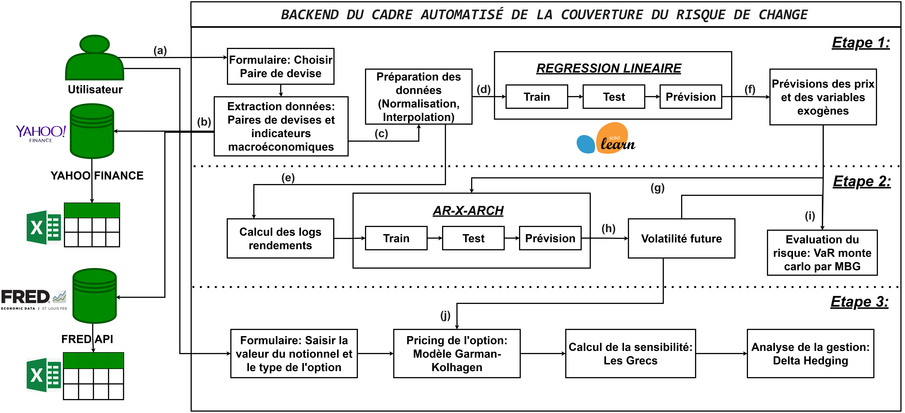

# Optimizing Foreign Exchange Risk Hedging for SMEs

## Introduction

La gestion du risque de change constitue un défi majeur pour les petites et moyennes entreprises, à cause des limites des instruments de couverture traditionnels et d’une évaluation souvent statique du risque, peu adaptée à la volatilité des marchés. Le présent mémoire propose une approche optimisée, qui repose sur le principe qu’une stratégie de couverture efficace doit s'appuyer sur une estimation prospective de l’incertitude, plutôt que sur une simple prévision directionnelle.

L'objectif principal de ce travail est de construire un cadre méthodologique complet qui combine la prévision des tendances par Machine Learning et la modélisation de la volatilité par le modèle économétrique *AR-X-GARCH* afin d’obtenir une estimation du risque (Value at Risk) qui prend en compte les informations du marché et les évolutions futures, calculée par une simulation de Monte Carlo. L'objectif final est de démontrer comment cette mesure de risque dynamique permet de concevoir des stratégies de couverture par options de change plus robustes et flexibles, offrant ainsi aux entreprises un outil d'aide à la décision pour une gestion de risque fiable et stratégique.

---

## Objectif du projet

Ce projet de fin d’études, intitulé \textbf{"Optimisation de la couverture du risque de change"}, a pour objectif principal de dépasser les approches classiques de gestion du risque en proposant une méthodologie intégrée et complète. L’idée principale est de montrer qu’une stratégie de couverture optimale ne se résume pas au simple choix d’un instrument financier, mais qu’elle repose sur une évaluation dynamique et prospective du risque. Dans cette optique, le projet s’appuie sur trois volets complémentaires: la prévision des taux de change à l’aide de modèles de Machine Learning, la mesure du risque au moyen de modèles économétriques et enfin, la mise en œuvre opérationnelle de la couverture à travers des instruments dérivés comme les options de change. L’approche adoptée vise donc à concevoir des stratégies de couverture sur mesure, non plus basées sur une vision statique du risque, mais calibrées sur une analyse dynamique des conditions de marché futures, permettant de sécuriser les marges tout en préservant des opportunités.

---

## Structure du projet

Afin d’atteindre l’objectif défini dans la section précédente, une méthodologie structurée a été élaborée, organisée en quatre étapes successives formant une chaîne cohérente d’analyse et de mise en œuvre :

1.  **Modélisation prédictive du taux de change:**
    La première étape consiste à anticiper l’évolution la plus probable du taux de change EUR/USD. Cette prévision repose sur le modèle Machine Learning de régression linéaire, qui fournit le scénario central autour duquel le risque pourra être évalué et géré.

2.  **Évaluation dynamique du risque de change:**
    Une simple prévision ponctuelle ne suffit pas à une gestion efficace du risque. Il est donc nécessaire de quantifier l’incertitude qui l’accompagne. Pour ce faire, la volatilité est modélisée au moyen d’un *AR-X-ARCH*, dont les résultats, combinés à la tendance centrale, alimentent une simulation de Monte Carlo. Cette approche produit une distribution complète des scénarios futurs, résumée à travers un indicateur clé: la Value at Risk (VaR).

3.  **Conception de la stratégie de couverture par options:**
    La troisième étape consiste à transformer la mesure du risque en une action concrète de protection. Sur la base de la VaR calculée, une stratégie de couverture est élaborée en retenant l’option de change, instrument apprécié pour sa flexibilité et son profil asymétrique. Cette phase inclut la détermination précise des paramètres de l’option (prix d’exercice, échéance) ainsi que sa valorisation, effectuée à l’aide du modèle de Garman-Kohlhagen.

4.  **Suivi et gestion de la position de couverture:**
    Une couverture, notamment lorsqu’elle repose sur des options, ne peut être considérée comme figée. La dernière étape est donc consacrée à l’analyse dynamique de la position mise en place. Elle inclut l’étude de la sensibilité aux paramètres de marché à travers le calcul des Grecs, ainsi que l’illustration de la gestion du risque du vendeur d’option (iBanFirst) au moyen d’une simulation de la stratégie de *Delta Hedging*. Cette étape finale met en évidence la complexité de la couverture et l’importance d’une gestion active.

---

## Architecture générale du cadre automatisé de la couverture du risque de change

Le backend du cadre automatisé mis en place pour la couverture du risque de change n'est pas structuré comme des modules indépendants. Son architecture se décompose ainsi en une chaîne de traitement progressive et intégrée, où chaque étape s’appuie sur les résultats de la précédente formant un pipeline complet allant de la prévision initiale à la prise de décision finale.

Pour une compréhension approfondie de son fonctionnement, le schéma ci dessous détaille visuellement l'articulation de ces processus et les flux d’informations qui assurent leur cohérence.

`

---

**Description de l'Architecture :**

1.  **Choix de la devise :** L'utilisateur choisit la paire de devises à analyser.
2.  **Extraction des données :** Le système extrait les séries de prix historiques pour la paire choisie et les indicateurs macroéconomiques associés depuis les sources externes (Yahoo Finance, FRED API).
3.  **Prétraitement :** Le jeu de données brutes est unifié puis passe par une étape de prétraitement (normalisation, interpolation).
4.  **Alimentation du modèle de tendance :** Le dataset préparé alimente le pipeline du modèle de Régression Linéaire pour la prédiction de la tendance.
5.  **Calcul des rendements :** Les données historiques préparées sont également utilisées pour le calcul des log-rendements nécessaires à l'entraînement du modèle de volatilité.
6.  **Prévisions du modèle de tendance :** Le modèle de Régression Linéaire génère les prévisions des prix futurs ainsi que celles des variables exogènes.
7.  **Injection des variables exogènes :** Les prévisions des variables exogènes (issues de l'étape f) sont injectées comme inputs dans la phase de prévision du modèle AR-X-ARCH.
8.  **Prévisions du modèle de volatilité :** Le modèle $AR-X-ARCH$ génère les prévisions de volatilité conditionnelle future.
9.  **Simulation et calcul de la VaR :** Les prévisions de prix (f) et de volatilité (h) sont combinées pour alimenter la simulation de Monte Carlo par MBG et calculer la Value at Risk.
10. **Valorisation de l'option :** La prévision de volatilité (h) est également utilisée comme paramètre d'entrée pour la valorisation de l'option de couverture.